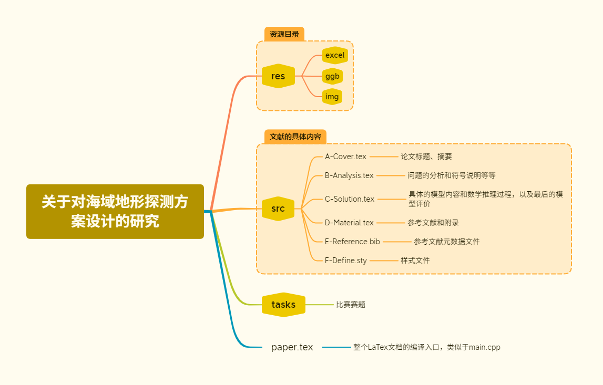

# 就《关于对海域地形探测方案设计的研究》Latex工程文件的说明

本项目是2023年全国大学生数学建模竞赛“高教杯”参赛作品，所选题目为**B题**，荣获省一等奖。我们尝试通过解析几何与凸包等算法，解决海域地形探测问题，给出Python代码，求出最终结果。

与此同时，为了方便编写LaTex工程，我们队伍引用了我开发的一款针对于“高教杯”数学建模竞赛的LaTex工程模版[（点击这里跳转到模板工程）](https://github.com/hereismg/MathematicalModelingEssayTemplate)，也为该模板的做出了应用范例。如果你同样是以为数学建模参赛选手，本工程文件也许会为你队伍的工作流有一些启发。

## 环境配置方案

- 文本编辑器：Visual Studio Code
- 文字排版引擎：LaTex
- 项目管理与多人协同：git+github

## 工程结构

## 撰稿人

@hereismg

@WxyDZDgn

@DikkooXie

## 免责声明

**本项目仅用于数学建模和LaTeX交流学习使用，禁止抄袭、洗稿后参加任何比赛、投稿任何期刊！**